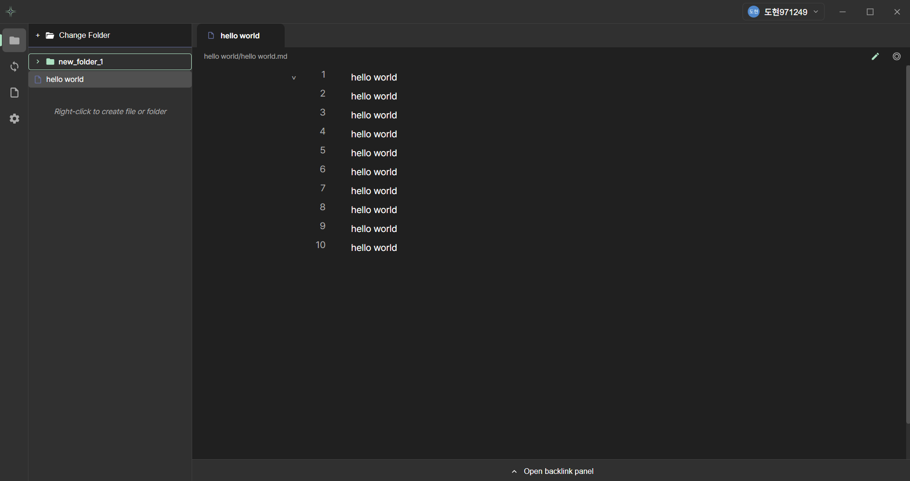
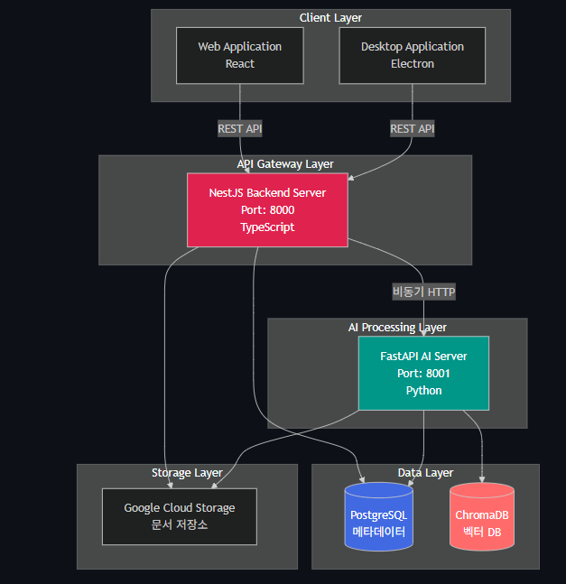
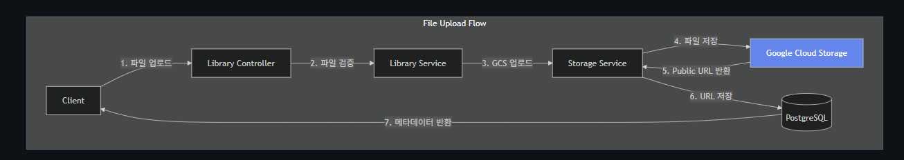
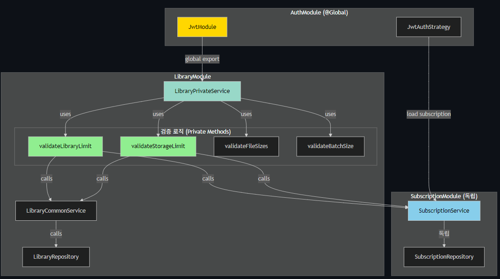
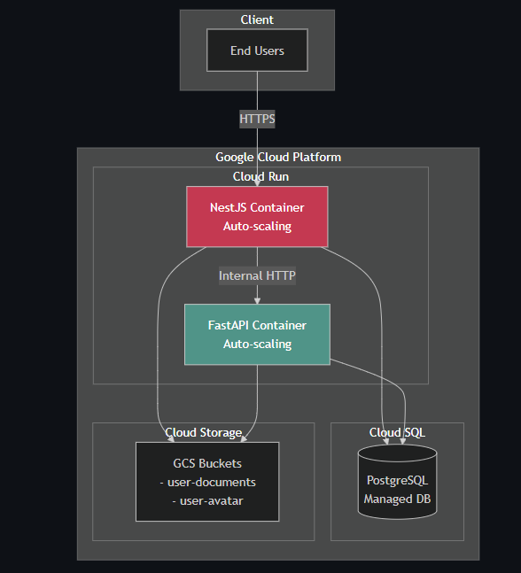

# NewLearn Note

## 개발 동기

옵시디언으로 공부 노트를 쓰고, 블로그에 정리하고, 구글링으로 자료를 찾는 루틴을 반복하다 보면 항상 여러 탭을 오가게 됩니다. 집중하려는 순간마다 컨텍스트가 끊겼고, 내가 공부한 내용과 공유된 자료가 각자 다른 곳에 파편화되어 있어 나중에 찾기도 번거로웠습니다.

이 불편함에서 출발해 **노트 작성, 클라우드 동기화, 공개 공유, 다른 사람의 학습 자료 참조**까지 하나의 앱에서 해결하는 플랫폼을 기획했습니다. GitHub처럼 Library에 노트를 push/pull하고, Publish 버튼 하나로 공개 노트를 배포하며, 다른 사람의 공개 노트를 링크(``)로 연결하면 집단지성 네트워크가 자동으로 형성되는 구조입니다. AI 어시스턴트 기능은 별도 프로토타입 [Nura](https://1dohyeon.github.io/projects/nura)에서 먼저 검증한 뒤 통합할 예정입니다.

## 맡은 작업

팀 프로젝트로 진행했으며, 저는 **NestJS 백엔드 전반과 GCP 인프라 구축**을 담당했습니다. 인증 시스템, 라이브러리 및 노트 관리 API, 파일 스토리지 파이프라인, 구독/용량 제한 시스템, Cloud Run 배포까지 백엔드의 설계부터 운영까지 책임졌습니다.

[시스템 아키텍처 상세](https://github.com/newlearnnote/server-demo/blob/main/docs/ARCHITECTURE.md) / [데이터베이스 설계](https://github.com/newlearnnote/server-demo/blob/main/docs/DATABASE.md)

## 개발 과정

### 1. 웹과 데스크톱 앱을 동시에 지원하는 인증 설계

NewLearn Note는 웹 앱과 Electron 데스크톱 앱을 모두 지원합니다. Google OAuth 2.0으로 로그인을 구현하는 건 어렵지 않았지만, **두 플랫폼에 토큰을 안전하게 전달하는 방식이 달라야 한다**는 점이 문제였습니다.

웹은 httpOnly Cookie로 XSS 공격을 차단할 수 있지만, 데스크톱 앱은 브라우저 쿠키를 사용할 수 없습니다. OAuth 콜백이 브라우저에서 일어나는데 토큰을 Electron으로 어떻게 넘겨줄지 고민했고, **Deep Link(`newlearnnote://`)** 방식을 선택했습니다. OAuth 콜백 시 플랫폼을 판별해 웹은 쿠키로, 데스크톱은 커스텀 프로토콜 URL에 토큰을 담아 앱을 직접 호출하는 구조입니다.

보안 측면에서는 Refresh Token Rotation을 적용했습니다. 토큰을 갱신할 때마다 기존 토큰을 즉시 무효화하고, 이미 무효화된 토큰이 재사용되면 해당 사용자의 모든 세션을 일괄 폐기합니다. 토큰 탈취가 발생해도 피해를 최소화할 수 있는 구조입니다.

[인증 흐름 상세](https://github.com/newlearnnote/server-demo/blob/main/docs/AUTH_FLOW.md) / [보안 아키텍처](https://github.com/newlearnnote/server-demo/blob/main/docs/SECURITY.md)

### 2. 노트 퍼블리싱과 파일 접근 보안

노트를 공개할 때 단순히 파일을 공개 URL에 올려두면 인증 없이 누구나 접근할 수 있어 private 노트가 노출될 위험이 있었습니다. 반대로 모든 파일 요청을 서버를 거쳐 처리하면 트래픽 부담이 커집니다.

이를 해결하기 위해 GCS의 **Signed URL** 전략을 채택했습니다. 파일을 `private/`와 `published/` 폴더로 구분하고, private 파일은 소유자만 15분 유효 Signed URL을 발급받을 수 있도록 `LibraryOwnerGuard`로 제한했습니다. published 파일은 누구나 Signed URL로 접근 가능하지만, URL이 만료되면 재발급이 필요합니다. 서버를 거치지 않고 클라이언트가 GCS와 직접 통신하므로 서버 부하도 없습니다.

[파일 스토리지 전략 상세](https://github.com/newlearnnote/server-demo/blob/main/docs/FILE_STORAGE.md)

### 3. 라이브러리 삭제 시 발생한 의존성 역전 문제: 이벤트 패턴 도입

팀에서 개발하다 예상치 못한 설계 충돌이 생겼습니다. **라이브러리를 삭제하면 그 안에 연결된 노트들도 함께 삭제**되어야 하는데, 이걸 구현하려면 `LibraryService`에서 `NoteService`를 직접 호출해야 했습니다. 그런데 `NoteService` 역시 라이브러리 정보를 조회하기 위해 `LibraryService`를 참조하고 있었고, 결국 **양방향 의존성(순환 의존성)** 이 발생했습니다.

팀원은 `NoteService`의 라이브러리 참조를 제거하고 `LibraryService`가 직접 노트까지 관리하는 방향을 제안했습니다. 하지만 이렇게 하면 `LibraryService`가 노트 도메인의 책임까지 떠안게 되어 모듈 경계가 무너진다고 생각했습니다.

저는 **도메인 이벤트 패턴**을 대안으로 제시했습니다. 라이브러리가 삭제될 때 `LibraryDeletedEvent`를 발행하고, `NoteService`가 해당 이벤트를 구독해 관련 노트를 삭제하는 구조입니다. 두 모듈이 서로를 직접 참조하지 않으면서도 삭제 연쇄를 처리할 수 있었고, 팀원도 이 방식이 확장에 유리하다는 데 동의해 채택했습니다.

같은 맥락에서 구독 정보 조회도 정리했습니다. 초기에는 Guard에서 플랜 체크와 용량 검증까지 수행하다 보니 Guard의 역할이 비대해졌고, `SubscriptionModule`과 `LibraryModule` 사이에 양방향 의존성이 생겼습니다. 비즈니스 규칙 검증을 Guard에서 Service 레이어로 이동하고, `LibraryModule → SubscriptionModule` 단방향 의존성만 유지하도록 정리했습니다. JWT 인증 시 subscription 정보를 user와 함께 한 번에 로딩해 매 요청마다 발생하던 추가 DB 조회도 제거했습니다.

[모듈 의존성 구조 상세](https://github.com/newlearnnote/server-demo/blob/main/docs/MODULE_DEPENDENCY.md)

### 4. 플랜별 저장 용량 제한 시스템

구독 플랜에 따라 라이브러리 개수와 저장 용량을 다르게 제한해야 했습니다. 제한 검증을 어느 레이어에서 할지가 관건이었는데, 앞서 Guard에서 비즈니스 로직을 처리했던 경험을 교훈 삼아 처음부터 Service 레이어에서 검증하도록 설계했습니다.

플랜 / 가격 / Library 개수 / 저장 용량 / AI 기능
- REE / 무료 / 1개 / 500MB / X /
- BASIC / $5/월 / 무제한 / 5GB / X /
- PREMIUM / $10/월 / 무제한 / 10GB / O /

파일 업로드 시 개별 파일 크기(10MB), 배치 업로드 크기(50MB), 총 사용 용량(플랜별)을 순서대로 검증하며, 초과 시 현재 플랜 정보와 남은 용량을 포함한 에러 메시지를 반환해 사용자가 상황을 바로 파악할 수 있게 했습니다.

[저장 용량 제한 시스템 상세](https://github.com/newlearnnote/server-demo/blob/main/docs/STORAGE_LIMIT.md)

[핵심 코드: 플랜별 용량 제한 검증](https://github.com/newlearnnote/server-demo/blob/main/api/src/library/library-private.service.ts)

[핵심 코드: 저장 용량 문자열 파싱 유틸리티](https://github.com/newlearnnote/server-demo/blob/main/api/src/library/library-common.service.ts)

### 5. 서버리스 인프라 구축

처음에는 비용을 아끼려고 GCP VM에 PostgreSQL을 직접 설치하는 방식을 검토했습니다. 그런데 패치, 백업, 장애 대응까지 직접 관리해야 한다는 부담이 컸고, 트래픽이 몰릴 때 수동으로 스케일링해야 한다는 점도 문제였습니다.

결국 **Cloud Run + Cloud SQL** 조합으로 전환했습니다. Cloud Run은 요청이 없을 때 인스턴스를 0으로 줄이고 트래픽에 따라 자동으로 확장하므로 인프라 관리 부담이 거의 없습니다. Docker 이미지는 빌드 단계와 실행 단계를 분리한 Multi-stage Build로 구성해 최종 이미지 크기를 50~70% 줄이고 소스 코드가 이미지에 포함되지 않도록 했습니다.

[인프라 구성 상세](https://github.com/newlearnnote/server-demo/blob/main/docs/INFRASTRUCTURE.md)

## 배운 점

이 프로젝트를 통해 설계 결정이 얼마나 멀리까지 영향을 미치는지 체감했습니다. Guard에서 비즈니스 로직을 처리하던 초기 설계가 모듈 간 양방향 의존성으로 이어졌고, 이를 바로잡는 데 적지 않은 리팩토링 비용이 들었습니다. 처음부터 레이어별 책임을 명확히 나눠야 한다는 교훈을 실제 비용으로 배웠습니다.

크로스 플랫폼 인증 설계도 인상 깊었습니다. 웹과 데스크톱이라는 두 환경이 같은 OAuth 플로우를 공유하면서도 보안 요구사항이 다르기 때문에, 플랫폼별로 다른 전달 방식을 설계해야 했습니다. 단순히 기능을 구현하는 것이 아니라 각 환경의 제약을 이해하고 그에 맞는 전략을 선택하는 과정이 흥미로웠습니다.

팀원과의 의견 차이를 이벤트 패턴으로 해결한 경험은, 기술적 선택이 단순한 구현 문제가 아니라 팀 내 합의와 설명의 문제이기도 하다는 것을 보여줬습니다. 대안을 제시할 때 "이게 맞다"보다 "이렇게 하면 어떤 점이 나아진다"는 방식으로 설득하는 것이 더 효과적이었습니다.
